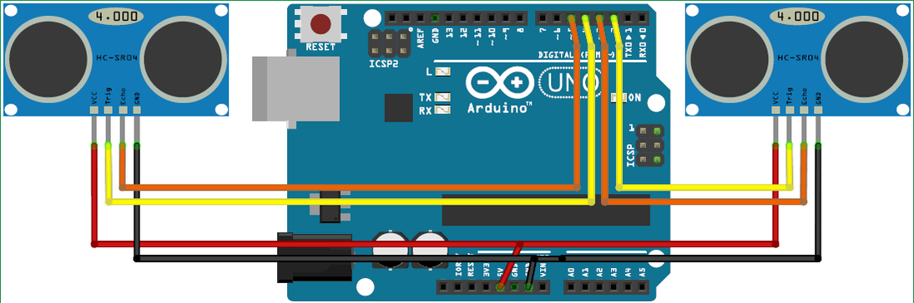

# hand-gesture-control-computer
A project to control computer features using hand gestures.
# OVERVIEW
Using Hand gestures for controlling laptop features is a creative and innovative strategy of communication between users and devices.
In contrast to existing techniques, the approach of control of computer features using hand gestures is game-changing. It not only improves accesibility but also opens up new doors for human-computer interaction.The project aims to make devices such as the mouse, the keyboard and the joystick controller redundant.The projects reduces the effort of interaction with computers through input devices using simple gestures. The use of this technology can be extended to access devices even as users refrain from physically touching them.
# WORKING
Gesture control is based on how the ultrasonic sensor will assess the location of the arm.A micro-controller is crucial for processing the primitive data; the Arduino UNO board is used for this purpose. The microcontroller passes the processed and thus calculated distance value provided by the sensor via the USB connection.The data sent by the sensor is handled by a PC program that conducts the necessary computations and integrates the data with the preset parameters (gesture resolution). Two ultrasonic sensors are used in this design to detect the location of the arm and are attached to the Arduino panel.As it is common knowledge, the ultrasonic sensor continually radiates sound waves that are then transmitted from the user's arm once again. The difference is sent between the signals.  Furthermore, the discovery of reflected back sound wave is determined by the micro-controller.
# PRE-REQUISITES FOR THE PROJECT:
## 1. Softwares:
  - Python:
  Basic knowledge of coding and syntax formats of python is essential for this project. Python is advantageous as it easy to comprehend and consists of large number of inbult libraries that facilitate faster outputs. python can be learned through tutorials on python.org and vieos available online. Python libraries [PyAutoGUI](https://pypi.org/project/PyAutoGUI/) and [PySerial](https://pypi.org/project/pyserial/) are essential for the project to function.
  - Arduino IDE
  Projects made using the Arduino are called sketches, and such sketches are usually written in a cut-down version of C++ (a number of C++ features are not included). Because programming a microcontroller is somewhat different from programming a computer, there are a number of device-specific libraries (e.g., changing pin modes, output data on pins, reading analog values, and timers). The progamming of such an Arduino Board is possible easily by the use of the Arduino IDE, which provides a near-complete environment for most Arduino-based projects. This IDE is open-sorce and can be downloaded [here](https://www.arduino.cc/en/Main/Software)
## 2. Hardwares:
  - [Arduino UNO](https://store.arduino.cc/usa/arduino-uno-rev3):
  Arduino is an open source programmable circuit board that can be integrated into a wide variety of makerspace projects both simple and complex.  This board contains a microcontroller which is able to be programmed to sense and control objects in the physical world.   By responding to sensors and inputs, the Arduino is able to interact with a large array of outputs such as LEDs, motors and displays. 
  - [Ultrasonic Sensor HC-SR04](https://datasheet4u.com/datasheet-parts/HC-SR04-datasheet.php?id=1380136):
    Ultrasonic sensors use sound to determine the distance between the sensor and the closest object in its path.The sensor sends out a sound wave at a specific frequency. It then listens for that specific sound wave to bounce off of an object and come back. The sensor keeps track of the time between sending the sound wave and the sound wave returning and thus calculates thedistance of the obstacle from the sensor.
# Schematic Diagram

# Setup
 
# References
1. Kaoru Yamagishi, Lie Jing and Zixue Cheng, system for controlling personal computers
by hand gestures using a7 wireless sensor device published I IEEE.
2. Tejashree P. Salunke; S. D. Bharkad Power point control using hand gesture recognition
based on hog feature extraction and k-nn classification
3. Minh Q. Nguyen, Changzhi Li published in IEEE. (2010) “Radar and ultrasound
hybrid system for human computer interaction”
4. U. Rajkanna, M. Mathankumar and K. Gunasekaran published in IEEE “Hand gesture-
based computer control using microcontroller” on 7-8 jan 2012, Rohtak, Haryana,
India.
5. Rishabh Agrawal and Nikita Gupta published in IEEE. (2010) “Real Time Hand
Gesture Recognition for Human Computer Interaction”
# Contributors
* [Rishabh Runwal](https://github.com/rishabh-runwal)
* [Suraj Kumar](https://github.com/108pbsuraj)
* [Shivraj Dhonde](https://github.com/ShivrajDhonde)
* [Jatin Pardhi](https://github.com/jatinpardhi)
* [Aadesh Varude](https://github.com/AadeshVarude)
